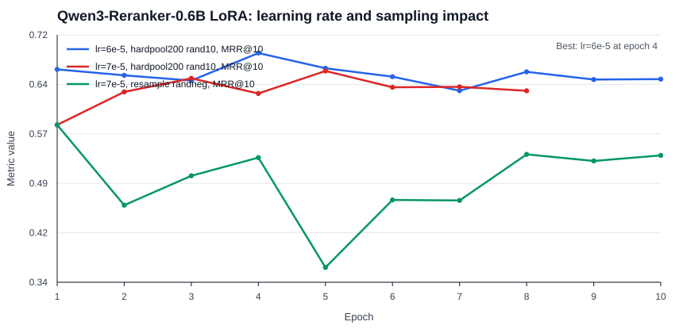
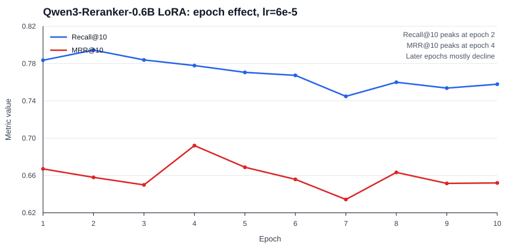
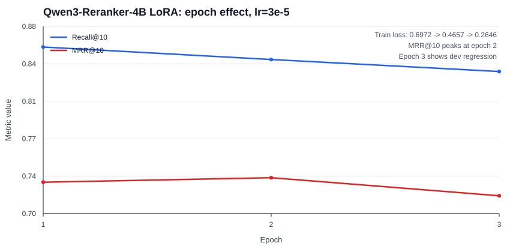

# stard_lab

English is the authoritative documentation for this project. A Chinese translation is available at `README.zh-CN.md`.

This repository contains training and evaluation recipes for STARD statute retrieval experiments, currently focused on Qwen3 reranker / cross-encoder training.

## Project Purpose

The original retrieval pipeline used in the STARD paper is a dense retrieval pipeline without a reranker. This project studies two questions: how much gain a reranker brings to STARD retrieval quality, and how much additional gain comes from fine-tuning the reranker on STARD training pairs.

## STARD

[STARD](https://arxiv.org/abs/2406.15313) is a Chinese statute retrieval benchmark built from real legal consultation queries issued by non-professionals. The published dataset contains 1,543 query cases and 55,348 candidate statutory articles, and is designed to test retrieval from everyday legal questions that often lack precise legal terminology.

The paper was later published in Findings of EMNLP 2024 as [STARD: A Chinese Statute Retrieval Dataset Derived from Real-life Queries by Non-professionals](https://aclanthology.org/2024.findings-emnlp.625/). The dataset and original code are available in the [STARD GitHub repository](https://github.com/oneal2000/STARD), which is MIT licensed.

## Contents

- `scripts/train_qwen3_reranker_lora.py`: LoRA training for Qwen3 Reranker on STARD.
- `scripts/cross_encoder_rerank_eval.py`: CrossEncoder rerank evaluation over first-stage rank files.
- `outputs/qwen3-embedding-4b-ms-bs16/rank.tsv`: first-stage Qwen3-Embedding-4B candidates used as hard negatives and dev rerank candidates.
- `outputs/qwen3-embedding-4b-ms-bs16/metrics.json`: first-stage retrieval metrics.
- `results/`: experiment configs, evaluation metrics, and representative reranked dev rankings.
- `docs/data_sources.md`: STARD data and training-data source notes.
- `docs/train_qwen3_reranker_lora_design.md`: detailed design notes for the LoRA trainer.

## Data

The original STARD dataset is not vendored here. Clone it as a sibling directory:

```bash
git clone https://github.com/oneal2000/STARD ../STARD
```

The training script automatically falls back to `../STARD/data` when local `data/queries.json` and `data/corpus.jsonl` are absent.

Required STARD files:

- `../STARD/data/queries.json`
- `../STARD/data/corpus.jsonl`
- `../STARD/data/example/train.query.txt`
- `../STARD/data/example/dev.query.txt`

## Install

Use a CUDA-compatible PyTorch build for the target machine, then install the remaining packages:

```bash
python -m venv .venv
source .venv/bin/activate
pip install -r requirements.txt
```

## Evaluation of Base and Fine-Tuned Reranker

All non-paper runs below use the same STARD train/dev split as the original repository split files. Reranker rows rerank the top-500 candidates produced by Qwen3-Embedding-4B.

All results are single-seed, single-run measurements. No variance estimate has been computed.

| Run | Embedder | Reranker used? | Reranker | Recall@10 | MRR@10 |
| --- | --- | --- | --- | ---: | ---: |
| STARD paper p7 Fine-tuned PLM Dense-STARD baseline | Chinese-RoBERTa-WWM fine-tuned dense retriever | No | None | 0.6061 | 0.4724 |
| Qwen3-Embedding-4B first stage | Qwen3-Embedding-4B | No | None | 0.6036 | 0.5010 |
| Qwen3-Reranker-0.6B base CrossEncoder | Qwen3-Embedding-4B | Yes | Qwen3-Reranker-0.6B base | 0.6495 | 0.5524 |
| Qwen3-Reranker-4B base CrossEncoder | Qwen3-Embedding-4B | Yes | Qwen3-Reranker-4B base | 0.7377 | 0.6165 |
| Qwen3-Reranker-0.6B LoRA lr6e-5 hardpool200 rand10 | Qwen3-Embedding-4B | Yes | Qwen3-Reranker-0.6B LoRA, epoch 4 | 0.7779 | 0.6921 |
| Qwen3-Reranker-4B LoRA lr3e-5 hardpool200 rand10 | Qwen3-Embedding-4B | Yes | Qwen3-Reranker-4B LoRA, epoch 2 | **0.8482** | **0.7345** |

The Fine-tuned PLM Dense-STARD model weights from the paper are not public, so this repository uses the general-purpose `Qwen3-Embedding-4B` embedder as the first-stage substitute. Without a reranker, `Qwen3-Embedding-4B` is essentially tied on Recall@10 and higher on MRR@10, making it a reasonable first-stage baseline for the reranker experiments.

Adding an unfine-tuned Qwen3 reranker improves over the first-stage ranking in these runs. The 0.6B base CrossEncoder raises Recall@10 from 0.6036 to 0.6495 and MRR@10 from 0.5010 to 0.5524. The 4B base CrossEncoder gives a larger reranking gain, reaching 0.7377 Recall@10 and 0.6165 MRR@10.

Fine-tuning the reranker gives the largest gains in the recorded runs. The 0.6B LoRA run reaches 0.7779 Recall@10 and 0.6921 MRR@10, while the 4B LoRA run reaches 0.8482 Recall@10 and 0.7345 MRR@10.

## Reproducibility Notes

| Item | Value |
| --- | --- |
| Random seed | 42 |
| Query split | 1,235 train queries, 308 dev queries, same split files as the original STARD repository |
| Corpus size | 55,348 statutory articles |
| Total STARD queries loaded | 1,543 |
| First-stage candidates | top-500 from `Qwen3-Embedding-4B` |
| GPU hardware | 2 x NVIDIA GeForce RTX 4090, 24,564 MiB each |
| Training devices | `cuda:0` for training, `cuda:1` for async dev evaluation |
| Software versions | `torch==2.5.1`, `transformers==4.57.6`, `peft==0.20.0`, `accelerate==1.14.0`, `sentence-transformers==5.7.0`, `modelscope==1.39.1` |
The first-stage embedder and base CrossEncoder rows are evaluation-only runs in this repository.

## How The Reranker Trainer Builds Examples

The current trainer is LoRA, not QLoRA. It loads the base model with `AutoModelForCausalLM.from_pretrained(..., torch_dtype=...)` and attaches PEFT `LoraConfig` adapters. It does not use `bitsandbytes`, `load_in_4bit`, `load_in_8bit`, or any quantized base-model loading path.

Training positives come from `queries.json` `match_id` labels. Negatives are built at runtime:

- `hard_negative_pool_k=200`: take the first-stage top-200 candidates for each query, remove gold documents, and use that pool for hard negatives.
- `hard_negatives=30`: sample 30 documents from the hard-negative pool.
- `random_negatives=10`: sample 10 additional non-gold documents from the full corpus.

Design motivation, not an ablation result: legal articles can be lexically and semantically close, so hard negatives are intended to expose the reranker to plausible but non-gold statutes. Random negatives are included to keep obviously irrelevant articles in the training distribution and reduce dependence on one dense retriever's near-miss distribution. The main risk is false negatives when STARD labels are incomplete, so best-checkpoint selection on dev metrics is important.

## Training Details of Qwen3-Reranker-0.6B

The 0.6B LoRA runs use the same `train.query.txt` and `dev.query.txt` split as the original STARD repository. The best run shown above used:

- Base model: `Qwen/Qwen3-Reranker-0.6B`
- Training method: LoRA, not QLoRA
- LoRA config: `r=16`, `alpha=32`, `dropout=0.05`
- LoRA target modules: `q_proj,k_proj,v_proj,o_proj,gate_proj,up_proj,down_proj`
- Max length: 1024
- Candidate top-k: 500
- Hard-negative pool: top-200 non-gold first-stage candidates
- Per-query negatives: 30 hard negatives plus 10 random negatives
- Train micro-batch size: 14
- Gradient accumulation steps: 2
- Effective batch size: 28 pairs per optimizer step
- Eval batch size: 12
- Random seed: 42
- Best observed learning rate in these single-seed runs: `6e-5`

Learning-rate comparison: in these single-seed runs, `6e-5` produced the highest observed 0.6B MRR@10 peak. The recorded `7e-5` hardpool and resampling runs were lower, but this should not be read as a general learning-rate conclusion without repeated seeds.



Epoch behavior: for the `6e-5` run, Recall@10 peaked at epoch 2 while MRR@10 peaked at epoch 4. Later epochs mostly declined in this single run, which suggests possible overfitting to the training pairs and candidate distribution. Use the best dev checkpoint rather than the final epoch.



## Training Details of Qwen3-Reranker-4B

The 4B LoRA run also uses the original STARD train/dev split and the same Qwen3-Embedding-4B top-500 first-stage candidates. The recorded run used:

- Base model: `Qwen/Qwen3-Reranker-4B`
- Training method: LoRA, not QLoRA
- LoRA config: `r=16`, `alpha=32`, `dropout=0.05`
- LoRA target modules: `q_proj,k_proj,v_proj,o_proj,gate_proj,up_proj,down_proj`
- Max length: 1024
- Candidate top-k: 500
- Hard-negative pool: top-200 non-gold first-stage candidates
- Per-query negatives: 30 hard negatives plus 10 random negatives
- Train micro-batch size: 2
- Gradient accumulation steps: 14
- Effective batch size: 28 pairs per optimizer step
- Eval batch size: 4
- Learning rate: `3e-5`
- Epochs: 3
- Random seed: 42

The 4B run improved from epoch 1 to epoch 2 on MRR@10, then regressed at epoch 3 while training loss continued to drop from 0.6972 to 0.4657 to 0.2646. This pattern is consistent with early overfitting, but it is still a single 3-epoch run; epoch 2 is the selected checkpoint for this recorded run.



## Train Qwen3 Reranker LoRA

Example command matching the recorded 0.6B run:

```bash
CUDA_VISIBLE_DEVICES=0 \
python scripts/train_qwen3_reranker_lora.py \
  --model-source modelscope \
  --rank-tsv outputs/qwen3-embedding-4b-ms-bs16/rank.tsv \
  --output-dir outputs/qwen3-reranker-0.6b-lora-stard-bs14-lr6e-5-ep10-hardpool200-rand10 \
  --candidate-top-k 500 \
  --hard-negative-pool-k 200 \
  --hard-negatives 30 \
  --random-negatives 10 \
  --epochs 10 \
  --train-batch-size 14 \
  --gradient-accumulation-steps 2 \
  --eval-batch-size 12 \
  --learning-rate 6e-5 \
  --max-length 1024 \
  --resample-hard-negatives-each-epoch \
  --resample-random-negatives-each-epoch
```

For 4B LoRA training, use the recorded config in:

```text
results/outputs/qwen3-reranker-4b-lora-stard-bs2-ga14-lr3e-5-ep3-hardpool200-rand10/train_config.json
```

## Evaluate A CrossEncoder

```bash
python scripts/cross_encoder_rerank_eval.py \
  --model Qwen/Qwen3-Reranker-4B \
  --model-source modelscope \
  --input-root outputs \
  --rank-tsv outputs/qwen3-embedding-4b-ms-bs16/rank.tsv \
  --output-root outputs/qwen3-reranker-4b-cross-encoder \
  --top-k 500 \
  --batch-size 16 \
  --torch-dtype bfloat16
```

## License

This repository is licensed under the MIT License. See `LICENSE`.

The upstream STARD dataset and original code are provided by the STARD authors in
the [STARD GitHub repository](https://github.com/oneal2000/STARD), which is also
MIT licensed.
